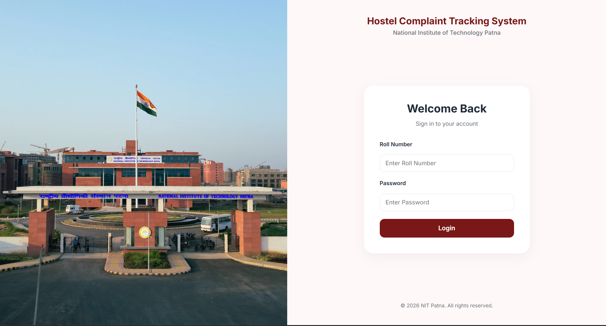

# 🏫 Hostel Complaint Tracking System


A production-grade, full-stack application designed to streamline the lifecycle of university hostel maintenance and service complaints. 

This system moves beyond basic CRUD operations to implement a strict **Role-Based State Machine** spanning four distinct user tiers (Students, Hostel Office, Wardens, and HMC Core).



---

## 🎯 The Problem & The Solution

**The Problem:** In many universities, hostel maintenance requests (plumbing, electrical, carpentry) are tracked on paper registers or chaotic WhatsApp groups. This leads to lost requests, zero accountability, unmeasured resolution times, and frustrated students.

**The Solution:** A centralized, multi-tenant digital portal where:
- **Students** have a transparent view of their request lifecycle.
- **Hostel Office Staff** can assign and track pending tasks efficiently.
- **Wardens & Admins (HMC)** have high-level dashboards to monitor staff performance, identify overdue complaints, and enforce accountability.

---

## 🚀 Key Features by Role

### 👨‍🎓 1. Student Portal
- **Complaint Lodging:** Upload descriptions, priority levels, and photographic evidence.
- **Real-Time Timeline:** View exact timestamps of when a complaint was assigned, escalated, or resolved.
- **Resolution Confirmation:** A complaint isn't fully closed until the student hits "Confirm Resolution". Otherwise, they can instantly Reopen it.
- **Downloadable PDF Slips:** Generate official PDF receipts for lodged complaints.

### 🏢 2. Hostel Office (Maintenance Staff)
- **Task Queue:** View all incoming complaints specific to their assigned hostel.
- **Assignment Engine:** Assign complaints to specific maintenance workers (plumbers, electricians).
- **Progress Tracking:** Update notes as work is done (which instantly pushes to the student's timeline).

### 👨‍⚖️ 3. Warden Dashboard
- **Performance Analytics:** Track how many complaints each office staff member has resolved vs. left pending.
- **Escalation Queue:** Handle "High Priority" complaints or complaints escalated by the office.
- **Action Workflows:** Wardens can append remarks, send tickets back to the office, or escalate severe issues to the central HMC committee.

### 🏛️ 4. HMC (Hall Management Centre) Admin
- **Global Overview:** See metrics across *all* hostels simultaneously.
- **Hostel Performance:** Identify which hostels are underperforming in resolution times.
- **Force Actions:** Override capabilities to forcefully close globally escalated tickets.

---

## 🛠️ Architecture & Documentation

This project was built with a focus on clean architecture, robust API design, and modular UI components. 

Dive deeper into the engineering decisions through our dedicated documentation:

- 🏗️ **[System Architecture](docs/architecture.md):** Understand the High-Level Design (HLD) and core component interactions.
- 🗄️ **[Database Design](docs/database.md):** View the Entity-Relationship (ER) diagram and schema rationale.
- 🔄 **[Complaint Lifecycle & Workflows](docs/workflows.md):** Trace the exact State Machine and Sequence Diagrams for complaint resolution.
- 🚀 **[Deployment Guide](docs/deployment.md):** Instructions for spinning up the Dockerized environment.

---

## 🔌 API Documentation (Swagger)

The backend exposes a strictly typed RESTful API. We use `drf-spectacular` to automatically generate OpenAPI 3.0 documentation.

Once the backend is running, you can explore the API endpoints interactively:

- **Swagger UI:** `http://localhost:8000/api/docs/`
- **ReDoc:** `http://localhost:8000/api/redoc/`
- **Raw OpenAPI Schema:** `http://localhost:8000/api/schema/`

---

## 💻 Quickstart (Local Development)

### Prerequisites
- Docker & Docker Compose
- Node.js (v18+)

### 1. Boot up the Backend (Django + Postgres + Redis)
```bash
docker-compose up -d --build
```
*The backend will be available at `http://localhost:8000`.*

### 2. Run Database Migrations & Seed Data
```bash
docker exec -it complaint-backend python manage.py migrate
# Optional: Load initial data or create a superuser
docker exec -it complaint-backend python manage.py createsuperuser
```

### 3. Boot up the Frontend (React + Vite)
```bash
cd frontend
npm install
npm run dev
```
*The frontend will be available at `http://localhost:5173`.*

---

