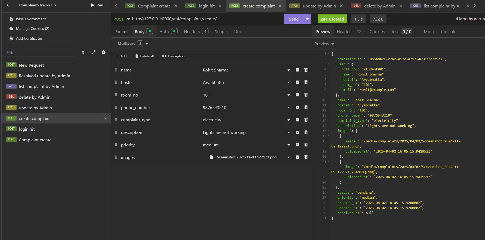
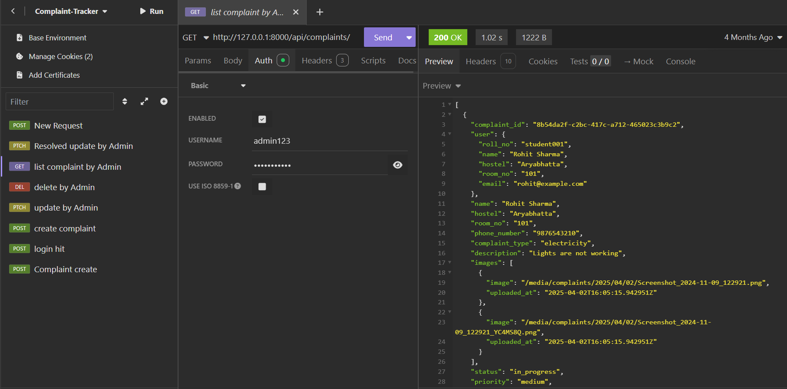
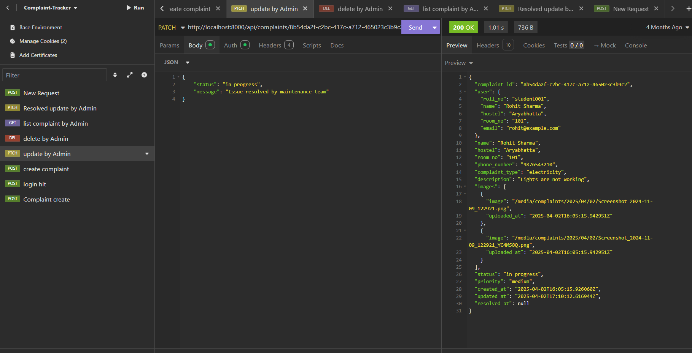

# College Complaint Tracking System - Backend

This is the backend API for a complaint tracking system for college students and admins.  
It allows students to file complaints about issues like mess, electricity, etc., and track their status. Admins can manage, update, and resolve complaints.

---

## Features

- **User Authentication**
  - Session-based login/logout with roll number and password.
  - Permissions enforced to restrict data access by user role.

- **Complaint Management**
  - Students can create complaints with multiple image uploads.
  - View their own complaints with filtering (status, type, priority).
  - Admins can view all complaints and filter by various fields.
  - Admins can update complaint status and priority.
  - Complaints support pagination (10 items per page).
  - Status updates create logs to track changes over time.

- **Performance & Security**
  - Caching complaint lists per user for 1 minute to reduce DB load.
  - Request throttling at 100 requests per day per user.
  - Filtering and ordering support on complaint lists.

- **Admin Panel**
  - Custom admin interface to manage Users, Complaints, Complaint Images, and Status Logs.
  - Inline display of complaint images and status logs in admin.
  - Color-coded complaint status in admin list view.

---

## Tech Stack

- Python 3.x  
- Django  
- Django REST Framework  
- Django Filters  
- MySQL (configurable database)  
- Django cache backend (for caching)

---

## API Endpoints

| Endpoint                      | Method | Description                           | Permissions          |
|-------------------------------|--------|---------------------------------------|----------------------|
| `/api/login/`                 | POST   | Login with roll_no & password          | Public               |
| `/api/logout/`                | POST   | Logout user                            | Authenticated        |
| `/api/complaints/`            | GET    | List complaints (filtering, ordering, pagination) | Authenticated |
| `/api/complaints/create/`     | POST   | Create new complaint with images       | Authenticated        |
| `/api/complaints/<complaint_id>/` | GET | Retrieve complaint details             | Owner or Admin       |
| `/api/complaints/<complaint_id>/update/` | PATCH | Update complaint (admin only)        | Admin                |
| `/api/complaints/<complaint_id>/delete/` | DELETE | Delete complaint (owner or admin)    | Owner or Admin       |

---

## Testing

All APIs have been thoroughly tested using **Insomnia (API tool)**, **Django Admin**, and **direct browser requests**.

### 1. Create Complaint (POST)
Successfully created a complaint with image upload.  
Status: **201 Created**



---

### 2. List Complaints (GET)
Admin fetching all complaints with pagination and filtering.



---

### 3. Update Complaint by Admin (PATCH)
Admin updating complaint status to **resolved**.



---

## Setup Instructions

1. Clone repository and create a virtual environment:

    ```bash
    git clone <repo-url>
    cd complaint-tracker-backend
    python -m venv venv
    source venv/bin/activate  # Linux/macOS
    venv\Scripts\activate     # Windows
    ```

2. Install dependencies:

    ```bash
    pip install -r requirements.txt
    ```

3. Configure database settings and cache backend in `settings.py`.

4. Run migrations:

    ```bash
    python manage.py migrate
    ```

5. Start development server:

    ```bash
    python manage.py runserver
    ```

---

## Notes

- **Authentication** uses Django’s session framework; clients must handle cookies (`csrftoken`, `sessionid`).
- **Caching** improves performance by storing complaint lists per user for 1 minute.
- **Throttling** restricts API usage to 100 requests/day per user to prevent abuse.
- **Pagination** defaults to 10 complaints per page; configurable via query params.
- **Admin interface** includes inline display of complaint images and status logs for easy monitoring.

---

## Future Enhancements (Planned)

- Real-time notifications on complaint status changes.
- PDF slip generation with QR codes for complaint resolution confirmation.
- Auto-escalation of complaints after SLA periods.
- Frontend web application using React to consume these APIs.

---

Feel free to explore and contribute!

---
