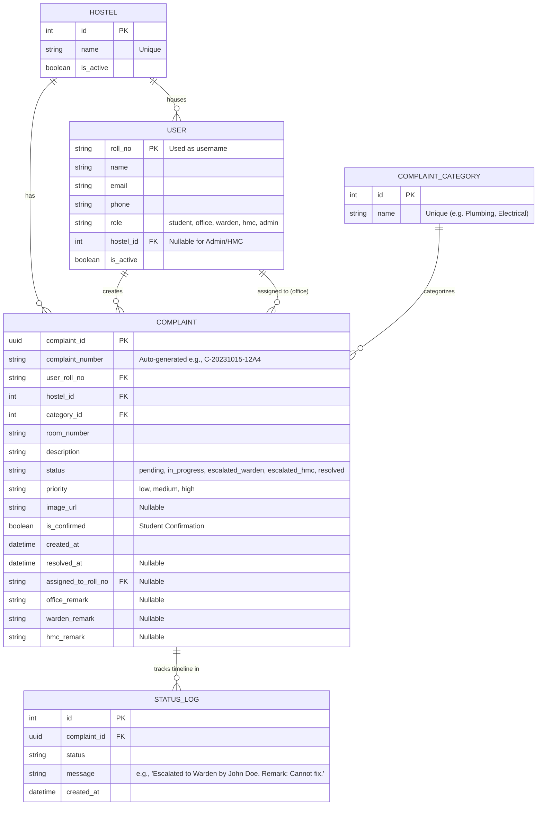

# 🗄️ Database Design

This document details the Entity-Relationship (ER) schema of the Hostel Complaint Tracking System. The database is relational, currently utilizing **PostgreSQL** in production environments.

---

## 📊 Entity-Relationship (ER) Diagram

---

## 🧠 Schema Design Decisions & Normalization

### 1. `User` as a Unified Table
- Instead of having separate tables for `Student`, `Staff`, `Warden`, and `Admin`, we use a **Single Unified User Table** extending Django's `AbstractBaseUser`.
- **Why?** It drastically simplifies Authentication. By driving permissions purely off a `role` enum field, we avoid complex polymorphic associations or multi-table joins just to log a user in.

### 2. UUID Primary Keys for Complaints
- `Complaint` utilizes a UUID (`complaint_id`) as its primary key rather than a sequential integer.
- **Why?** 
  - Prevents enumeration attacks (a student cannot guess `id=5` if they are `id=4`).
  - Prepares the system for distributed database scaling (sharding).
- *Note:* We also generate a human-readable `complaint_number` (e.g. `C-2023-4XF`) purely for display and searching, but relations strictly use the UUID.

### 3. The `StatusLog` (Append-Only Event Sourcing)
- Instead of just overwriting a `status` field on the `Complaint` table, we implement an append-only `StatusLog` table.
- **Why?** 
  - **Auditability:** It provides a 100% accurate, tamper-proof history of exactly *when* and *who* changed a complaint's state. 
  - **User Experience:** This table directly powers the "Timeline" UI in the student and staff portals, providing Amazon-style package tracking visibility.

### 4. Denormalization of `Hostel` in `Complaint`
- A complaint belongs to a `User`, and a `User` belongs to a `Hostel`. Strictly speaking, storing `hostel_id` on the `Complaint` table is redundant (denormalized).
- **Why?** 
  - **Read Performance:** Staff and Wardens filter the global queue by their assigned `hostel_id`. By placing `hostel_id` directly on the `Complaint` table, we save a massive `JOIN` operation on every single dashboard load, optimizing for heavy read-throughput.
