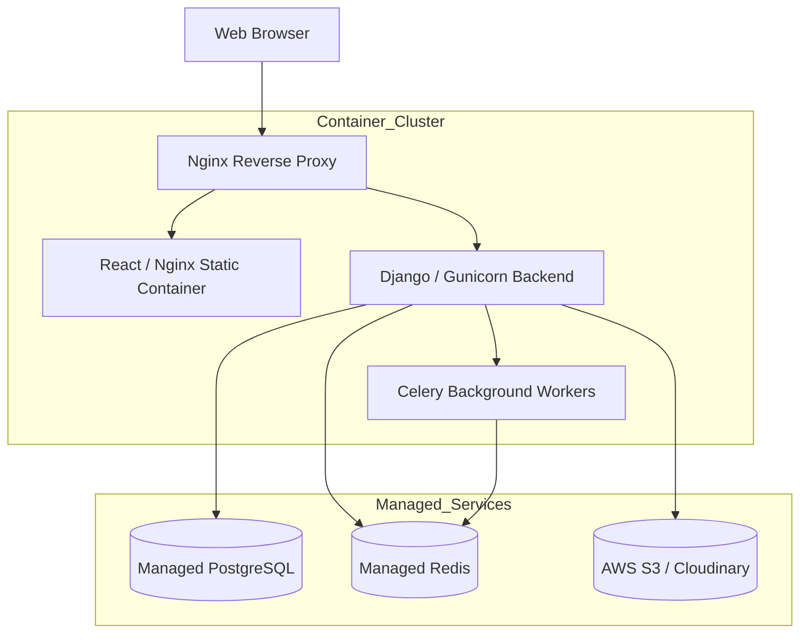

# 🚀 Deployment & Infrastructure

This document outlines the deployment strategy for the Hostel Complaint Tracking System. The application is containerized using Docker, allowing for parity between local development and production environments.

---

## 🏗️ Production Architecture



### Infrastructure Components
1. **Reverse Proxy (Nginx):** Terminates SSL/TLS and routes `/api/` traffic to the backend, and root traffic to the frontend static files.
2. **Web Server (Gunicorn):** Runs the Django application via WSGI in production, handling multiple concurrent requests.
3. **Task Queue (Celery + Redis):** Used to offload slow processes (PDF generation, email sending, cron jobs) outside of the HTTP request cycle.
4. **Database (PostgreSQL):** The primary source of truth, offering strong ACID compliance.
5. **Object Storage (S3):** Stores user-uploaded complaint images (currently mocked locally, but architected to swap in a cloud provider via `django-storages`).

---

## 💻 Local Docker Quickstart

For local development and testing, `docker-compose` spins up the entire stack seamlessly.

### 1. Build and Run
From the root of the project:
```bash
docker-compose up -d --build
```
This commands boots up:
- `complaint-backend` (Django on port 8000)
- `complaint-db` (PostgreSQL 17 on port 5432)
- `complaint-redis` (Redis 7 on port 6379)

### 2. Apply Migrations
Whenever models change, apply migrations inside the backend container:
```bash
docker exec -it complaint-backend python manage.py makemigrations
docker exec -it complaint-backend python manage.py migrate
```

### 3. Creating an Admin
```bash
docker exec -it complaint-backend python manage.py createsuperuser
```

---

## 🔒 Security Best Practices for Production

If deploying this to AWS / GCP / DigitalOcean, ensure the following checklist is completed:

1. **Environment Variables:** Never commit `.env` to source control. Set `SECRET_KEY`, `DEBUG=False`, and database credentials securely via the cloud provider's secrets manager.
2. **CORS:** Restrict `CORS_ALLOWED_ORIGINS` in Django settings to exactly match the production frontend domain.
3. **Database Security:** Place PostgreSQL inside a private VPC subnet. Do not expose port 5432 to the public internet.
4. **Rate Limiting:** DRF is currently configured to throttle requests (1000/day per user). In production, configure Nginx or an API Gateway (like AWS API Gateway) to provide DDoS protection.
