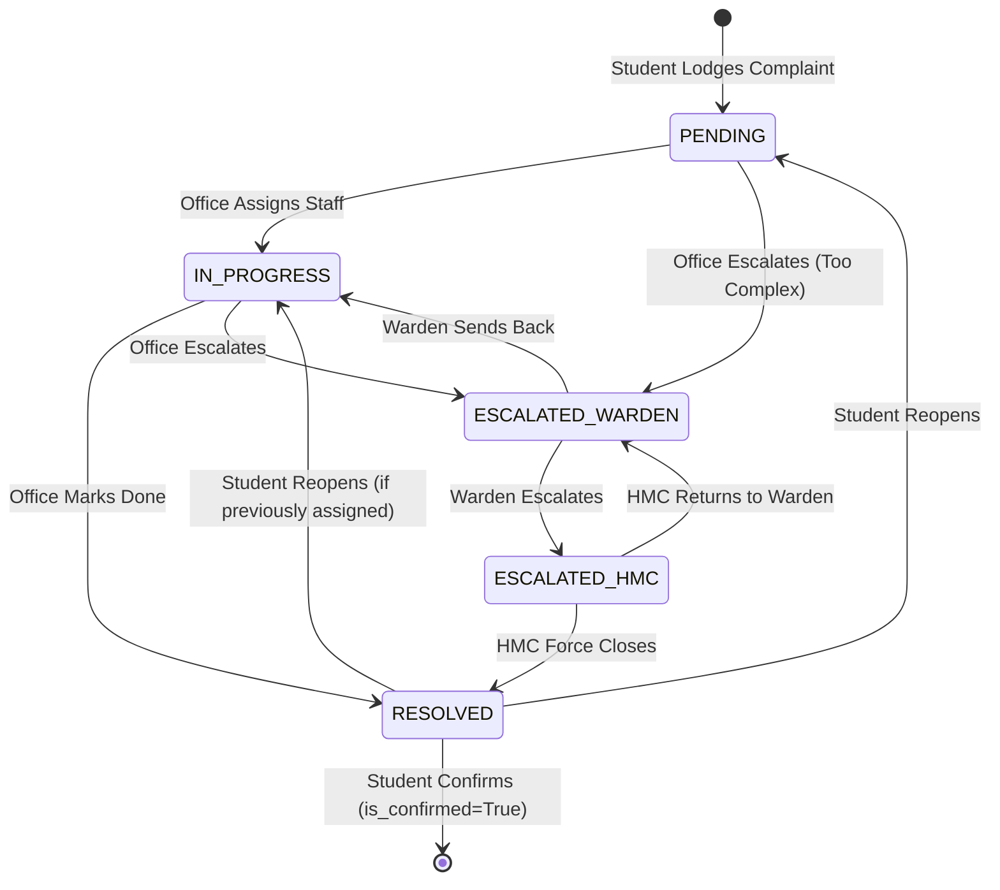
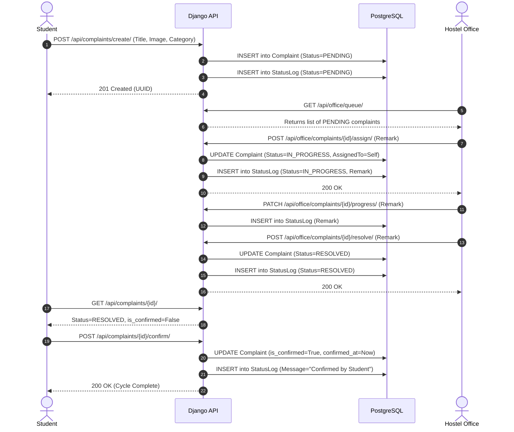

# 🔄 Workflows & Lifecycles

This document visualizes the core State Machine of a complaint and traces the exact sequence of events required to process it.

---

## 🚦 Complaint State Machine

The strict state transitions of a complaint ensure that a ticket cannot accidentally bypass an escalation tier or be closed prematurely.

### State Rationale
- **PENDING:** The initial state. The Hostel Office sees this in their "Incoming Queue".
- **IN_PROGRESS:** Indicates active work. Office Staff must assign the ticket to themselves or a worker to enter this state.
- **ESCALATED_WARDEN:** Triggered manually if the issue requires Warden approval (e.g., funding for a new fan).
- **ESCALATED_HMC:** Triggered if the Warden cannot resolve it and needs Central Administration.
- **RESOLVED:** A temporary terminal state. A ticket is marked "Resolved" by staff, but it is not permanently closed until the student confirms.

---

## 🔁 Sequence Diagram (Standard Resolution)

Here is a full trace of a standard "Happy Path" resolution, from creation to confirmation.

### Sequence Highlights
1. **Idempotent Assignments:** Step 3 ensures a complaint can only be assigned if it is currently `PENDING`.
2. **Immutable Auditing:** Every major transition (Steps 2, 4, 6, 9, 11) forces an insertion into the `StatusLog`, ensuring complete historical traceability for the Timeline UI.
